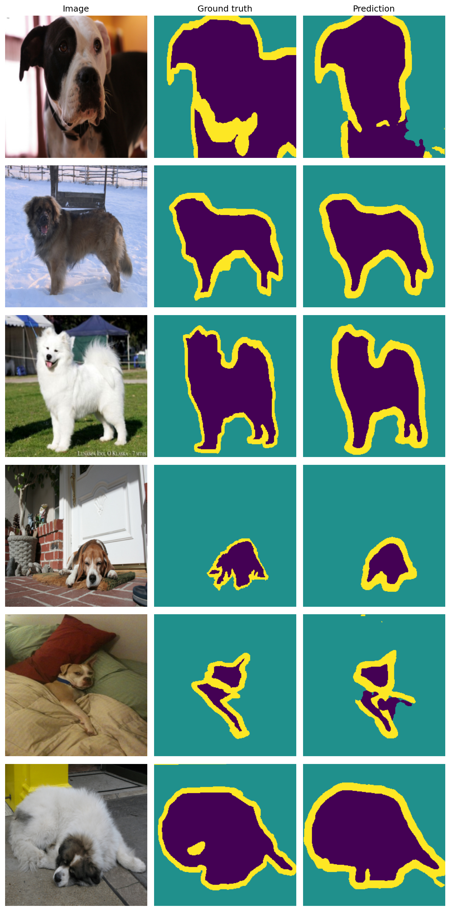
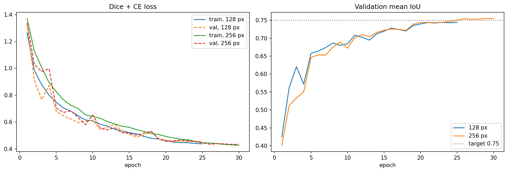

# U-Net from Scratch: Pet Segmentation on Oxford-IIIT Pet

A U-Net encoder-decoder with skip connections, implemented from scratch in PyTorch and trained for 3-class pixel-wise segmentation (pet / background / boundary) with a combined Dice + cross-entropy loss.

**Result: 0.755 mean IoU on validation, 0.759 on the held-out test set (3,669 images).**



## Results

| Run | Input size | Epochs | Val mIoU | Pet | Background | Boundary |
|---|---|---|---|---|---|---|
| 1 | 128 x 128 | 25 | 0.744 | 0.83 | 0.90 | 0.50 |
| 2 | 256 x 256 | 30 | **0.755** | 0.84 | 0.91 | 0.52 |

Final evaluation of run 2 on the test set, run once after all tuning was finished:

| Split | mIoU | Pet | Background | Boundary |
|---|---|---|---|---|
| Test | **0.759** | 0.826 | 0.905 | 0.546 |



Train and validation loss stay close together through both runs, so the model is not overfitting.

## Architecture

```
Input 3 x 256 x 256
  |
  DoubleConv  32 ------------------------------> concat -> DoubleConv  32 -> 1x1 conv -> 3 logits
  | maxpool                                        ^ up
  DoubleConv  64 --------------------> concat -> DoubleConv  64
  | maxpool                              ^ up
  DoubleConv 128 ----------> concat -> DoubleConv 128
  | maxpool                    ^ up
  DoubleConv 256 -> concat -> DoubleConv 256
  | maxpool           ^ up
  DoubleConv 512 (bottleneck)
```

- `DoubleConv`: (3x3 conv, BatchNorm, ReLU) twice, with padding so the output matches the input size
- Downsampling: 2x2 max-pool. Upsampling: 2x2 transposed convolution
- Skip connections concatenate each encoder feature map onto the decoder map of the same resolution
- 1x1 output convolution gives 3 logits per pixel; no softmax inside the model
- 7.76 M parameters (base width 32; the original paper uses 64)

## Method

**Data.** `torchvision.datasets.OxfordIIITPet` with segmentation trimaps. The official `trainval` split is divided 3,312 / 368 into train and validation with a fixed seed; the official `test` split is held out. Trimap labels 1/2/3 are remapped to 0/1/2 (pet / background / boundary). All three classes are kept.

**Paired augmentation.** `torchvision.transforms.v2` with `tv_tensors.Image` and `tv_tensors.Mask`, so random resized crops and horizontal flips apply identically to image and mask. Masks are resized with nearest-neighbour interpolation so that no invalid class values are created. Colour jitter and normalisation apply to the image only.

**Loss.** Cross-entropy plus soft Dice, equally weighted. Cross-entropy gives stable per-pixel gradients; Dice is averaged per class, which stops the dominant background class (about 62% of pixels) from swamping the boundary class (about 12%).

**Metric.** Mean IoU computed from a confusion matrix accumulated over the whole evaluation set, rather than averaged per batch.

**Training.** Adam (lr 1e-3), cosine annealing schedule, mixed precision (`torch.amp`), batch size 32, on a free Colab T4 GPU. Run 2 takes about 20 minutes.

## Observations

- Pixel accuracy is misleading for this task: predicting "background" everywhere scores about 47% accuracy on a training batch but only 0.16 mIoU.
- The boundary class limits the mean. It scores about 0.55 IoU against 0.83 and 0.91 for the other two. The band is narrow and hand-drawn at varying widths, so small localisation errors cost a lot of overlap.
- Doubling the resolution from 128 to 256 px made little difference: the two validation curves track each other closely, and most of run 2's gain came from training five epochs longer.
- The dataset labels collars and tags as "unclassified" (the boundary class). The model tends to label them as pet, as the first prediction sample shows.

## Possible next steps

- Train longer or use base width 64: train and validation loss are still equal, so the model is under-trained rather than at capacity
- Compare transposed convolution against bilinear upsampling + convolution in the decoder
- Use a pretrained ResNet-18 as the encoder

## Running it

Open `unet_pet_segmentation.ipynb` in Google Colab, set the runtime to T4 GPU, and run the cells top to bottom. The dataset (about 800 MB) downloads automatically and is cached to Google Drive.

## Reference

Ronneberger, Fischer, Brox. *U-Net: Convolutional Networks for Biomedical Image Segmentation*, 2015.
